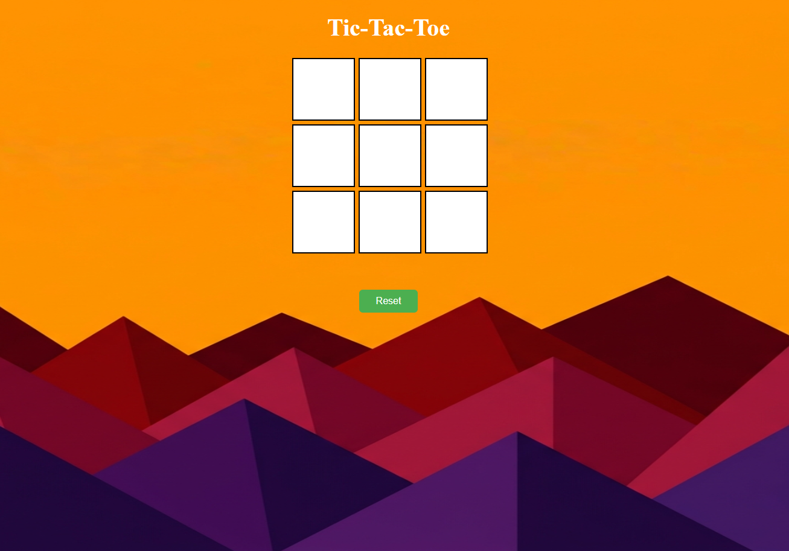
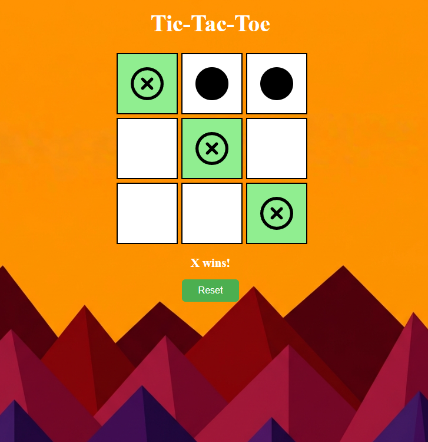
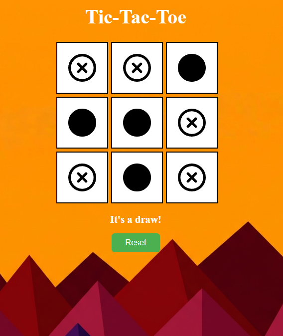

# Tic-Tac-Toe

A visually appealing and interactive Tic-Tac-Toe game built with HTML, CSS, and Vanilla JavaScript.

## Features
- **Interactive UI**: Beautiful fixed background with sleek grid design.
- **Dynamic Gameplay**: Alternating turns between 'X' and 'O' with smooth `pop-in` animations.
- **Winner Goes First**: The player who won the previous game gets to make the first move in the next game.
- **Scoreboard & Leaderboard**: Persistent tracking of total wins for both 'X' and 'O' across sessions.
- **Active Player Glow**: The scoreboard zooms and glows dynamically (Red for X, Blue for O) to indicate whose turn it is.
- **Sound Effects**: Synthesized audio using the Web Audio API for moves, wins, draws, and resets.
- **Move Tracking**: Displays exactly how many moves a player took to win.
- **Win & Draw Detection**: Automatically detects row, column, and diagonal wins or a draw when the board is full.

## How It's Made
This project is built using standard front-end web technologies:

1. **HTML5**: Structures the game board, the scoreboard, and the victory messages.
2. **CSS3**: Handles the visual presentation and aesthetics. Key implementations include:
   - **CSS Grid**: Used to create the perfect 3x3 layout for the board.
   - **Keyframe Animations & Transitions**: Provides bouncy entry effects for moves and smooth scaling/glowing effects for the active player scoreboard.
3. **Vanilla JavaScript**: Drives the core game mechanics, including:
   - **State Management**: Tracks current player, starting player, total wins, and move counts.
   - **Web Audio API**: Generates sound frequencies on the fly without needing external audio files.
   - **Win Validation**: Checks the current board state against a pre-defined array of 8 winning patterns.
   - **DOM Manipulation**: Dynamically updates the scoreboard, active glow classes, and injects SVG images.

## How to Play
1. Open the `index.html` file in any modern web browser.
2. The game starts with Player 1 (**X**). The active player is indicated by a glowing score box at the top.
3. Click on any empty white square to place your symbol.
4. Player 2 (**O**) then takes their turn.
5. The first player to align 3 of their symbols horizontally, vertically, or diagonally wins the game! The winner's score will increase.
6. The player who won will automatically get to make the first move in the next game.
7. Click the green **Reset** button at any time to clear the board and start a new match.

## Screenshots

### Initial Game State

### Player Win State

### Draw State

**Created by:** `Tanmay Joshi`
